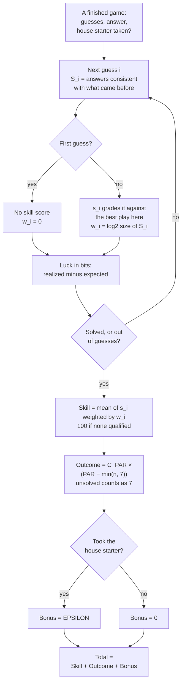
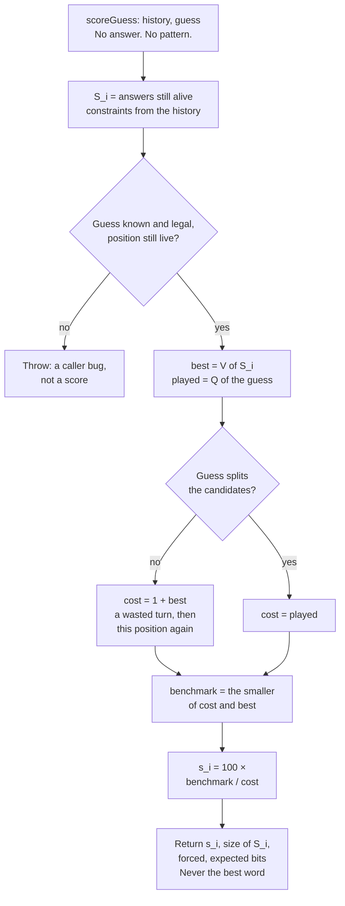
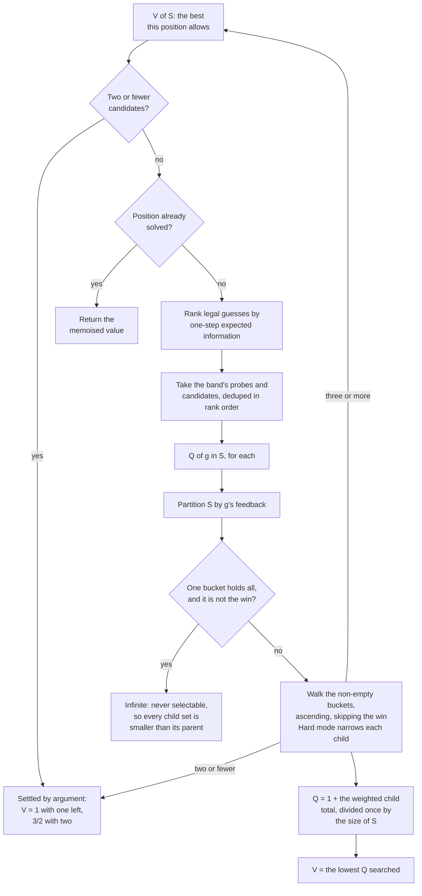

# How Par is scored

The implementation of spec §3, and what each constant trades. If you are looking
for the player-facing explanation, that lives in the results view; this is the
engineering account.

## The shape of a score

```
Total = Skill + Outcome + (took the house starter ? EPSILON : 0)
```

Three parts, deliberately separate, because they answer different questions.
**Skill** asks how well you played. **Outcome** asks how it turned out. The
**bonus** asks whether you took the shared bet. Keeping them apart is what lets
luck live in exactly one place.

The whole path, from a finished board to a number:



Two things are easier to read off the shape than off the formula. The first
guess reaches the total **only** through the outcome term, because its branch
produces no skill score to contribute. And luck is measured on every pass round
the loop, yet no edge carries it into the total — it exists for the results
table and nothing else.

## Skill

Every guess from the second onward is graded against the best play available in
that exact position:

```
s_i = 100 × Q(best legal guess, S_i) / Q(actual guess, S_i)
```

`Q(g, S)` is the expected total number of guesses to finish if you play `g` now
and continue optimally. `S_i` is the set of **answer-list** words still
consistent with everything revealed before guess `i`.

Three things about this are load-bearing.

**It is a ratio, not a difference.** The raw scale of "expected guesses lost"
varies enormously between the opening and the endgame, so a difference would not
be comparable across positions and 100 would not be reachable everywhere. A
ratio against the best available play means every position offers a real shot at
a perfect mark.

**It cannot see what happened.** `scoreGuess(history, guess)` takes no answer and
no resulting pattern. That is not a convention, it is the signature: a function
that cannot be told the outcome cannot let the outcome change a score.

**It never names the best word.** The return type carries a score, a luck figure
and a forced flag. The argmin exists inside the search and is never returned, so
no UI can leak what it was never handed.

Those three constraints leave a function of the position and nothing else:



Guesses are averaged weighted by `log2 |S_i|`:

```
Skill = Σ_{i ≥ 2, |S_i| ≥ 2} w_i · s_i / Σ w_i        w_i = log2 |S_i|
        (Skill = 100 if there are no such guesses)
```

A misstep with three hundred possibilities alive costs far more than one in a
forced endgame, so they should not count equally. Log-weighting also neutralises
hard-mode inflation, where late moves are frequently forced and would otherwise
pad a score with automatic full marks — a singleton position weighs `log2 1 = 0`
and cannot move the average at all.

**Guess 1 is never scored, under either opener path.** Opener choice expresses
itself only through the position it creates, which the outcome term prices at
fair odds. Scoring it as well would punish the bold random opener twice, and that
opener is a legitimate gamble rather than an exploit.

## Outcome

```
Outcome = C_PAR × (PAR − min(n, 7))
```

An unsolved game counts as seven guesses. This conversion happens in exactly one
function, `outcomePoints`, and that is a requirement rather than tidiness: **the
term has to stay linear in guess count.**

Linearity is the whole justification for rewarding luck at all. Under a linear
payout, minimising expected guesses and maximising expected points are the same
objective, so a gamble can win you a day but never a season. The moment the curve
bends upward — a jackpot for finishing in two — you are paying for variance
itself, and variance is free: anyone can manufacture it by guessing recklessly.
That converts a skill game into a lottery.

Fast finishes get badges. Never points.

## The luck figure

Alongside each guess, the results view shows realized information minus expected
information, in bits. Positive means the feedback broke better than the guess had
any right to expect.

It is display only and never enters a total. It is also shown **for guess 1**,
where skill deliberately says nothing — "your random opener ran hot today" is the
honest explanation for a fast finish, and it is a description of what happened
rather than a grade on the choice.

Because it is an expectation, it averages to zero across every answer a guess
could face. There is a test for that.

## The constants

All three live in [`src/engine/config/constants.ts`](../src/engine/config/constants.ts)
with their trade-offs written beside them.

| constant | value | validated range |
| --- | --- | --- |
| `C_PAR` | 4 points per guess | [3, 5] |
| `EPSILON` | 3 point starter bonus | [2, 4] |
| `PAR` | generated | recompute with the lists |

`C_PAR` **is the knob that trades daily drama against long-run fidelity.** Raise
it and single days get spikier and luckier; lower it and skill dominates but
daily results flatten into sameness. If you change it, you are making that trade
— do it knowingly.

`EPSILON` is sized to cover the small gap between a player's favourite opener and
a random decent one. Too large and everyone takes the house starter and then
ignores it; too small and nobody takes it and the mechanism is decoration. The
validated window is wide on both sides, so it is not a delicate number.

`PAR` is a single global constant, **never per-mode.** Hard-mode players sit
slightly over par for equivalent decision quality and that is accepted:
inflating one mode's scores to compensate for its difficulty would muddy what the
number means. The share badge tells the reader which mode was played.

## Par, and why it is anchored to strong play

`PAR` is the mean guess count for **strong play opening from house starters** —
deliberately not average-human play. If par were the average result, half the
field would be under par on any given day and the phrase would mean nothing.
Anchoring it to strong play means going under par is an actual accomplishment.

Most players will be over par most days. That is the honest baseline, and the
results copy carries it lightly rather than scolding.

It is a constant offset that cancels when two people compare the same day, so a
stale value never makes the competition unfair — it just makes the golf framing
lie. Recompute it whenever the word lists change:

```bash
npm run compute-par -- --days 300
```

That writes `src/engine/config/par.generated.ts`. It also reports what the house
starter costs against a fixed strong opener, which is how philosophy position 9's
"about a tenth of a guess" claim stays a checked fact.

### What it measured for the shipped lists

Over 300 days against word lists `fc66685a12af`:

```
PAR (house starter) 3.7100
  from SLATE          3.4700
  starter costs     0.2400 guesses
unsolved            0
distribution        2: 5   3: 102   4: 169   5: 23   6: 1
```

**`PAR` is 3.71, not the 3.50 the spec quotes**, and that difference is worth
understanding rather than papering over. Three things push it up, all of them
consequences of choices recorded elsewhere:

- Our answer list holds 3,000 words. A larger answer pool is simply a harder
  game, and the spec's 3.50 was measured against different lists.
- Our starter pool's distinct-letter tail is thin, which
  [`docs/wordlists.md`](wordlists.md) sets out in full. Weaker starters cost
  guesses, and the 0.24-guess gap against a fixed strong opener is that cost
  showing up. It is also more than philosophy position 9's "roughly a tenth of a
  guess" — that estimate was made against a cleaner pool.
- The simulation's strong play is bounded to a handful of probes and candidates
  per move, so it is a shade weaker than true optimal play, which inflates the
  mean slightly.

Because `PAR` is a constant offset it cancels whenever two people compare the
same day, so a higher value never makes the competition unfair. It shifts
everybody's total by the same +0.84 points and keeps the golf framing honest for
these lists rather than for someone else's.

## Checking the incentives still point the right way

Philosophy position 5 names the ordering the design targets:

> house starter + play well > own opener + play well > house starter, then
> ignore it and play well

The first gap is the bonus doing its job. The second matters more: taking the
bonus and then reverting to a memorised word must be clearly the worst of the
three, or the bonus is free money.

```bash
npm run check-incentives -- --days 120
```

Exits non-zero if the ordering breaks. Worth running after changing the word
lists or either constant.

### What it measured for the shipped configuration

Over 120 days, with `C_PAR` 4 and `EPSILON` 3:

| strategy | mean total | mean guesses | mean skill |
| --- | --- | --- | --- |
| house starter + play well | 103.11 | 3.683 | 100.0 |
| own opener + play well | 100.16 | 3.667 | 100.0 |
| house starter, then revert | 91.29 | 4.250 | 90.4 |

Both gaps point the right way. The first is +2.94 points — essentially the bonus,
less the small amount the house starter costs in guesses, which is the mild tax
on a bookmark habit the design is aiming for. The second is +8.87, and it is
large because the scoring does most of that work unaided: a memorised word played
at guess two is priced against a position where clues already existed, so it
loses on skill and on guess count at once. The bonus only has to cover the first
gap.

Skill reads 100.0 for both strong-play rows because the simulation's best move
*is* the benchmark it is scored against. That is a property of the harness rather
than a finding — what these runs measure is the effect of guess count and the
bonus, not differences in decision quality.

## Hard mode

Hard mode changes **only the legal set** — for the player's guess and for the
benchmark it is measured against. Never the formula. A player forced into a coin
flip by the rules played perfectly and is told so: the breakdown labels the move
forced rather than silently reporting a 100 it looks like they earned.

This is structural rather than a rule to remember. One `Ruleset` instance is
threaded through both sides of every comparison, so there is no path by which the
player and the benchmark could be judged against different legal sets.

## Approximation, and where it is exact

Exhaustively minimising over the full dictionary at every node is too slow, so
the search ranks legal guesses by one-step expected information and explores only
the best few plus the live candidates:

| candidates | probes | candidate guesses |
| --- | --- | --- |
| more than 200 | 2 | 1 |
| 61 to 200 | 3 | 2 |
| 16 to 60 | 6 | 4 |
| 15 or fewer | 12 | 12 |

Applied at every recursion depth, with the two sets deduped preserving rank
order.

`V` and `Q` are one recursion seen from two sides. The table above governs only
the middle of it; most of the rest is the places a node is settled instead of
searched:



Two suites check it, and they cover different things. `exactness.test.ts` runs
against a fourteen-word fixture, where full brute force is tractable — every
position there is in the bottom band, so what it proves is that the bottom band
is exact. `bands.test.ts` runs on the real lists across days chosen so all four
bands are actually reached, comparing against a wider ladder: **exact agreement
at fifteen candidates or fewer, and under 1.5 skill points above that.**

That split matches what the specification asks for. Exact where precision is
visible, near-exact elsewhere — with "near" measured rather than assumed.

**Endgames are not searched at all, they are settled by argument.** With one
candidate left `V = 1`, and with two `V = 1.5`, because a candidate guess is
always legal and either order finishes in one or two turns. Any bucket of two or
fewer short-circuits on the same reasoning. This is not an approximation, and it
is what makes the specification's exact 100 and exact 75 exact rather than
nearly right — the numbers those checks pin come out of closed-form arithmetic,
not out of a search that happens to converge.

If a player's guess somehow evaluates better than the search's best, theirs
becomes the benchmark and the guess scores 100. With only two probes above 200
candidates the benchmark is genuinely approximate, so this fires in practice —
and it surfaces as a 100 rather than as a score above it.

Performance rests on one observation: because guess 1 is never scored, every
position ever scored has already been filtered to a few hundred candidates. The
working set is therefore dictionary × *current candidates*, not dictionary × *all
answers* — roughly 2.6 MB rather than the 39 MB a full guess-by-answer matrix would need, built once per game and reused,
since a candidate set only ever shrinks.

## Determinism

A shared result has to re-score to the identical number on someone else's
machine, or comparing scores means nothing. That gets its own document:
[`docs/determinism.md`](determinism.md).
